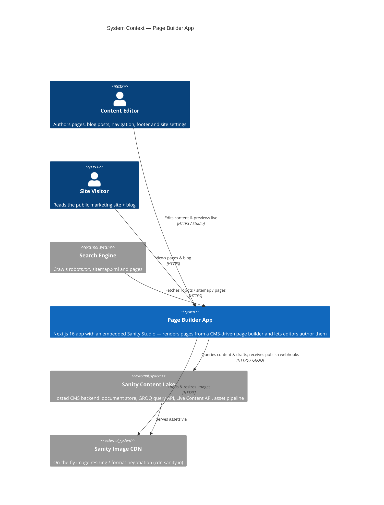
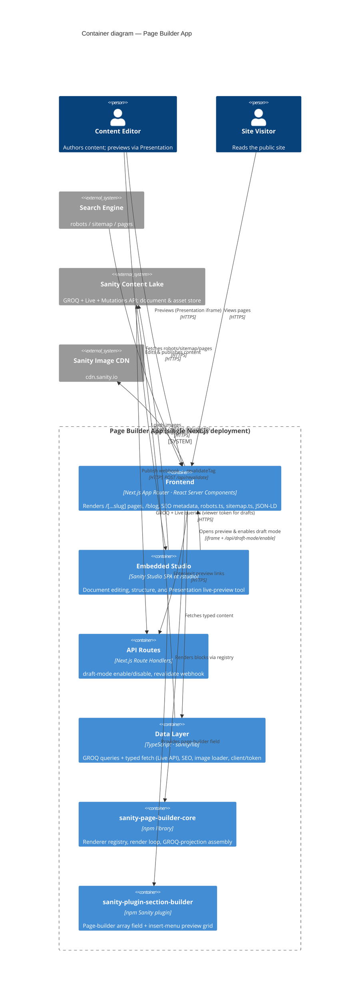
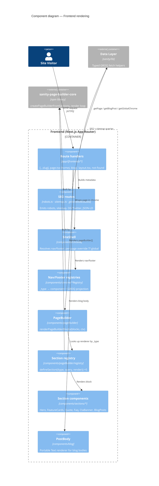
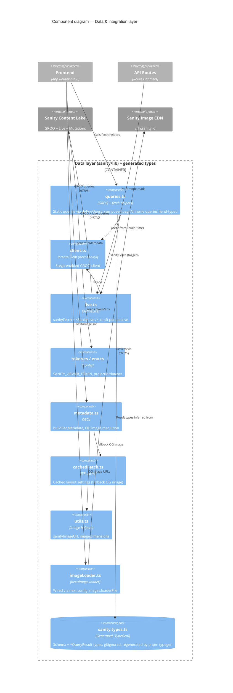

# Architecture (C4)

The [C4 model](https://c4model.com/) diagrams below describe this app at three
zoom levels — **Context**, **Container**, and **Component**. They're written as
[Mermaid](https://mermaid.js.org/) `C4*` diagrams and render on GitHub.

For the narrative version see [`README.md`](../README.md); for change-oriented
guidance see [`CLAUDE.md`](../CLAUDE.md).

> One deployment, two faces: a single Next.js app serves both the public
> **Frontend** and the **embedded Sanity Studio** at `/studio`. The only backend
> is the hosted **Sanity Content Lake**; there is no custom server or database.

---

## Level 1 — System Context

Who uses the system and what it talks to.

---

## Level 2 — Containers

Inside the single Next.js deployment. The two npm packages
(`@maciejtrzcinski/sanity-page-builder-core` and
`@maciejtrzcinski/sanity-plugin-section-builder`) are build-time
libraries, shown here because they own the page-builder wiring on each side.

---

## Level 3a — Components: Frontend rendering pipeline

How a request becomes HTML. The page-builder and chrome both use the same
registry pattern from `page-builder-core`.

---

## Level 3b — Components: Data & integration layer

`sanity/lib` plus the generated types. Everything that touches the Content Lake
or shapes typed results lives here.

---

## Notes on the diagrams

- **Single deployment.** Frontend, Studio, and API routes are one Next.js app
  (Studio mounts at `/studio` via a catch-all route). The C4 "containers" are
  logical, not separately deployed processes.
- **No custom backend.** The only system of record is the Sanity Content Lake;
  reads go through the Live Content API (`sanityFetch`) for instant updates with
  ISR as a baseline, and on-demand revalidation arrives via the publish webhook.
- **Two render registries, one pattern.** Both the page builder and the site
  chrome (nav/footer) map a Sanity `_type` → component + GROQ projection through
  `page-builder-core`; see Level 3a.
- **Types.** Query result types are generated by Sanity TypeGen; the composed
  page/chrome queries can't be statically typed and are hand-written (see
  README → _Types_).

To edit these, update the Mermaid blocks above and preview on GitHub or any
Mermaid-aware viewer.
